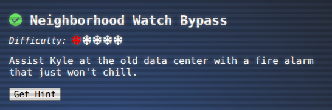
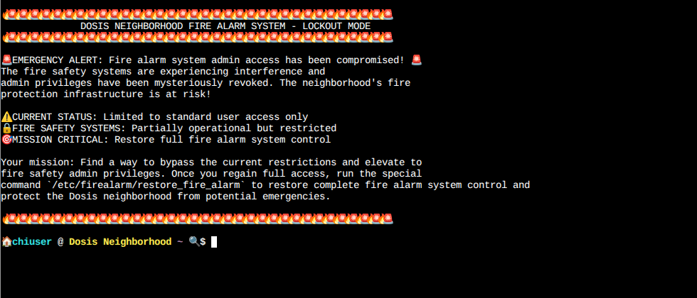
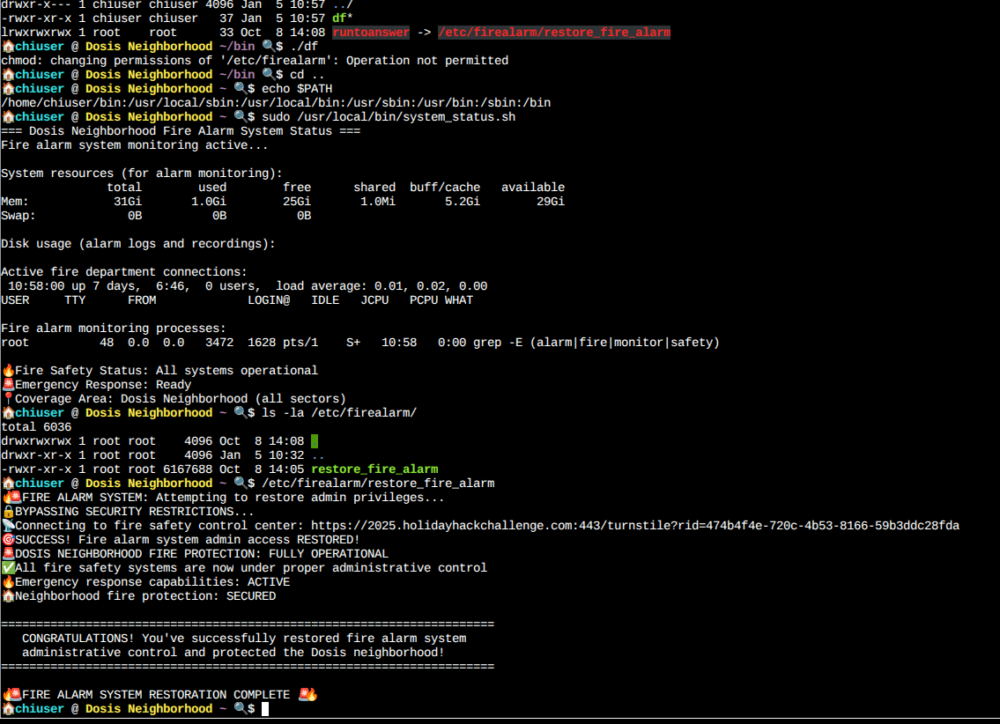

## Objective "Neighborhood Watch Bypass"

### Task and Solution

The task is learn about safe implementation of shell skripts.

If an attacker is able to control the $PATH, which is used in a shell skript
he can overwrite the binaries in the original shell skript and can leverage
the sudo mechanism to execute commands as a privileged account.

'sudo -l' also gives as a clue of what commands we are allowed to execute.

we simple create a new implementation of the "df" as a shell skript and 
will execute a "chmod 777" on the files, we would like to manipulate

